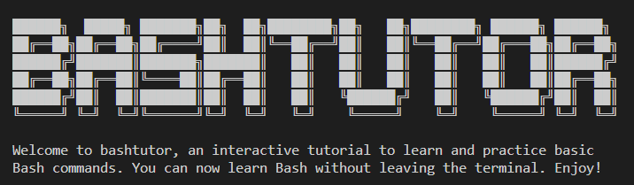

<h1 align="center">bashtutor</h1>

<h4 align="center">interactive tutorial to learn and practice basic Bash commands directly in the terminal</h4>
<br>


### Completion status
This program is currently a work-in-progress.

### Objectives of bashtutor
- learn Bash directly within the terminal, without needing to have a browser or book open
- jump between different lessons easily
- includes explanations of different commands
- includes practices to try out the commands

### Installation
You can install the package with:
```
git clone https://github.com/sky-aw/bashtutor.git
cd bashtutor
make
```

You can run the program located in your current direcotry with:
```
./bashtutor
```

### Additional notes
- written in C
- simulates a command shell
- allows the use of keyboard shortcuts like Ctrl-L, Ctrl-W, Ctrl-U, Ctrl-A, etc